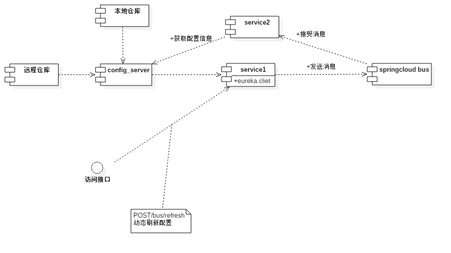

# 分布式配置中心

# 应用场景介绍

*   将服务中得配置统一管理
*   模块分为两个模块 config-client、config-server
*   config-server负责管理配置提供rest配置获取
*   config-client负责配置信息拉取、刷新到本地服务中

## 配置

```yaml
#server

spring:
  cloud:
    config:
      server:
        git:
          #git地址仓库存放
          uri: https://github.com/wuxinvip/base-cloud-config.git
          # 本地文件夹存放
          #uri: file://${user.home}/config-repo
          username:
          password:
          #多文件加指定
          search-paths: wuxinvip-message
          search-paths: wuxinvip-uc-api
          search-paths: wuxinvip-uc-service
          search-paths: wuxinvip-uc-repository
          search-paths: wuxinvip-project-api
          search-paths: wuxinvip-project-service
          search-paths: wuxinvip-project-repository
          #开启强势拉取
          force-pull: true

#config-server
#8020-8030
spring.application.name=config-server
server.port=8020

eureka.client.service-url.defaultZone=http://eureka.wuxinvip.com/
eureka.client.allow-redirects=true
eureka.client.fetch-registry=true

#client

spring:
  application:
    name: wuxinvip-uc-center
  cloud:
    config:
      allow-override: true
      #通过注册中心发现配置中心
      discovery:
        enabled: true
        service-id: CONFIG-SERVER
      #通过地址获取配置
      uri: http://localhost:8888/

server:
  port: 2222
eureka:
  client:
    service-url: http://127.0.0.1:1111/eureka/

```

## 流程说明

## 配置刷新

*   动态刷新



*   需要借助spring cloud bus 消息总线进行消息通知


