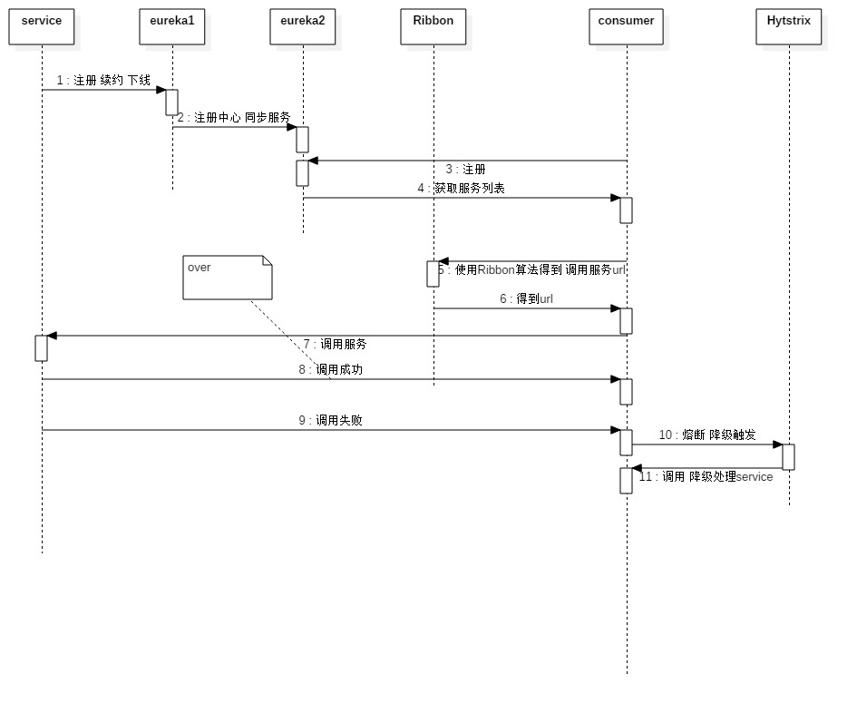
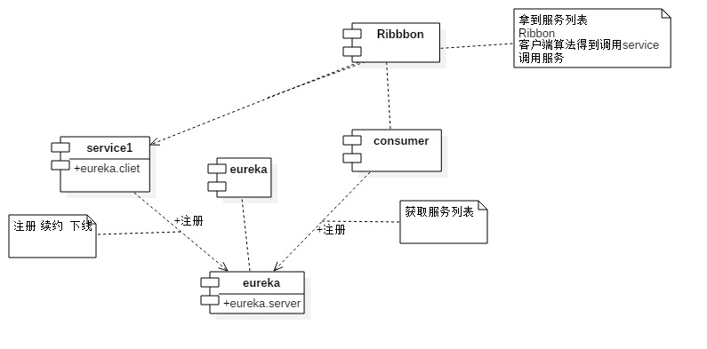

# 分布式注册中心

# 应用场景介绍

*   分布式服务调用注册发现管理
*   所有服务统一把自己的实例告诉一个公告人、所有人从这个公告人获取实例信息
*   获取实例信息后、结合feign进行调用
    
## 配置

```yaml
#server

spring:
  application:
    name: eureka-server
  profiles:
    active: dev
server:
  port: 7000
eureka:
  server:
    enable-self-preservation: false
  instance:
    hostname: eureka.wuxinvip.com
    ip-address: http://eureka.wuxinvip.com/eureka/
    appname: wuxinvip-uc-center
    health-check-url-path: /health
    status-page-url-path: /info
    prefer-ip-address: true
    lease-expiration-duration-in-seconds: 90
    lease-renewal-interval-in-seconds: 30
    
    
#client
spring:
  application:
    name: wuxinvip-uc-center
  profiles:
    active: dev
server:
  port: 8000
eureka:
  client:
    eureka-server-total-connections-per-host: 50
    register-with-eureka: true
    registery-fetch-interval-seconds: 30
    eureka-connection-idle-timeout-seconds: 30
    eureka-server-read-timeout-seconds: 8
    eureka-server-total-connections: 200
    service-url: http://:@localhost:8761/eureka,http://eureka.wuxinvip.com
    fetch-registery: true
    filter-only-up-instances: true
    eureka-server-connect-timeout-seconds: 30

```

## 流程说明

*   eureka-时序图



*   eureka-治理图




